# Diagrama Entidad-Relación: Backend Central (envaperu-workflow)

## Diagrama ER (Mermaid)

```mermaid
erDiagram

    %% ═══════════════════════════════════════
    %% CATÁLOGOS BASE (Entidades Fuertes)
    %% ═══════════════════════════════════════

    Maquina {
        int id PK "auto"
        string nombre UK
        string tipo
    }

    MateriaPrima {
        int id PK "auto"
        string nombre
        string tipo "VIRGEN | SEGUNDA"
    }

    Colorante {
        int id PK "auto"
        string nombre
    }

    Linea {
        int id PK "auto"
        int codigo UK
        string nombre UK "HOGAR | INDUSTRIAL"
    }

    Familia {
        int id PK "auto"
        int codigo UK
        string nombre UK "BALDES | JARRAS..."
    }

    FamiliaColor {
        int id PK "auto"
        int codigo UK
        string nombre UK "SOLIDO | CARAMELO..."
    }

    ColorProducto {
        int id PK "auto"
        string nombre
        int codigo
        int familia_id FK
    }

    Talonario {
        int id PK "auto"
        int desde
        int hasta
        string descripcion
        bool activo
        int ultimo_usado
    }

    %% ═══════════════════════════════════════
    %% CATÁLOGO PRODUCCIÓN
    %% ═══════════════════════════════════════

    Molde {
        string codigo PK "natural key"
        string nombre
        float peso_tiro_gr
        float tiempo_ciclo_std
        bool activo
    }

    MoldePieza {
        int id PK "surrogate"
        string molde_id FK
        string nombre
        string pieza_sku FK "nullable"
        int cavidades
        float peso_unitario_gr
    }

    Pieza {
        string sku PK "natural key"
        int linea_id FK
        int familia_id FK
        string tipo "SIMPLE | KIT | COMPONENTE"
        int molde_pieza_id FK "nullable"
        int color_id FK "nullable"
        string piezas "nombre display"
        int cavidad
        float peso
    }

    PiezaComponente {
        int id PK "surrogate"
        string kit_sku FK "Pieza.sku"
        string componente_sku FK "Pieza.sku"
        int cantidad
    }

    ProductoTerminado {
        string cod_sku_pt PK "natural key"
        int linea_id FK
        int familia_id FK
        int familia_color_id FK "nullable"
        int cod_producto
        string producto "nombre display"
        float peso_g
        string status
        string estado_revision
    }

    ProductoPieza {
        int id PK "surrogate"
        string producto_terminado_id FK
        string pieza_sku FK
        int cantidad
    }

    %% ═══════════════════════════════════════
    %% PRODUCCIÓN (core transaccional)
    %% ═══════════════════════════════════════

    OrdenProduccion {
        string numero_op PK "natural key OP-1322"
        int maquina_id FK
        string producto_sku FK
        string molde_id FK
        float snapshot_tiempo_ciclo
        float snapshot_horas_turno
        float snapshot_peso_colada_gr
        bool activa
    }

    SnapshotComposicionMolde {
        int id PK "surrogate"
        string orden_id FK
        string pieza_sku FK "nullable"
        int cavidades
        float peso_unit_gr
    }

    LoteColor {
        int id PK "surrogate"
        string numero_op FK
        int color_id FK
        string producto_sku_output FK "nullable"
        float meta_kg
        int personas
    }

    SeCompone {
        int id PK "surrogate"
        int lote_id FK
        int materia_prima_id FK
        float fraccion
        float calculo_peso_kg
    }

    SeColorea {
        int id PK "surrogate"
        int lote_id FK
        int colorante_id FK
        float gramos
    }

    RegistroDiarioProduccion {
        int id PK "auto"
        string orden_id FK
        int maquina_id FK
        date fecha
        string turno
        int colada_inicial
        int colada_final
        int snapshot_cavidades
        float snapshot_peso_neto_gr
    }

    DetalleProduccionHora {
        int id PK "auto"
        int registro_id FK
        string hora
        string maquinista
        string color
        int coladas_realizadas
    }

    ControlPeso {
        int id PK "auto"
        int registro_id FK
        float peso_real_kg
        string color_nombre
        int color_id FK "nullable"
        datetime hora_registro
    }

    HistorialEstadoOrden {
        int id PK "auto"
        string numero_op FK
        bool estado_anterior
        bool estado_nuevo
        string usuario
        string motivo
    }

    RecetaColorNormalizada {
        int id PK "auto"
        int color_id FK
        int colorante_id FK
        string producto_sku FK "nullable"
        float gr_por_kg
        int n_muestras
    }

    %% ═══════════════════════════════════════
    %% RELACIONES
    %% ═══════════════════════════════════════

    FamiliaColor ||--o{ ColorProducto : "1:N tiene"
    Linea ||--o{ ProductoTerminado : "1:N clasifica"
    Linea ||--o{ Pieza : "1:N clasifica"
    Familia ||--o{ ProductoTerminado : "1:N agrupa"
    Familia ||--o{ Pieza : "1:N agrupa"
    FamiliaColor ||--o{ ProductoTerminado : "1:N familia_color"

    ProductoTerminado ||--o{ ProductoPieza : "1:N BOM"
    Pieza ||--o{ ProductoPieza : "1:N en_productos"

    Pieza ||--o{ PiezaComponente : "1:N kit"
    Pieza ||--o{ PiezaComponente : "1:N componente"

    Molde ||--o{ MoldePieza : "1:N formas"
    MoldePieza ||--o{ Pieza : "1:N variantes"
    Pieza }o--o| MoldePieza : "N:1 molde_pieza_id"
    ColorProducto ||--o{ Pieza : "1:N colorea"

    Maquina ||--o{ OrdenProduccion : "1:N usa"
    ProductoTerminado ||--o{ OrdenProduccion : "1:N produce"
    Molde ||--o{ OrdenProduccion : "1:N opera"

    OrdenProduccion ||--o{ SnapshotComposicionMolde : "1:N congela"
    OrdenProduccion ||--o{ LoteColor : "1:N colores"
    OrdenProduccion ||--o{ RegistroDiarioProduccion : "1:N registros"
    OrdenProduccion ||--o{ HistorialEstadoOrden : "1:N historial"

    Pieza }o--o| SnapshotComposicionMolde : "0..1:N ref"

    ColorProducto ||--o{ LoteColor : "1:N lotes"
    ProductoTerminado ||--o{ LoteColor : "1:N output"
    LoteColor ||--o{ SeCompone : "1:N materiales"
    LoteColor ||--o{ SeColorea : "1:N pigmentos"
    MateriaPrima ||--o{ SeCompone : "1:N recetas"
    Colorante ||--o{ SeColorea : "1:N recetas"

    Maquina ||--o{ RegistroDiarioProduccion : "1:N registros"
    RegistroDiarioProduccion ||--o{ DetalleProduccionHora : "1:N horas"
    RegistroDiarioProduccion ||--o{ ControlPeso : "1:N bultos"
    ColorProducto ||--o{ ControlPeso : "1:N pesajes"

    ColorProducto ||--o{ RecetaColorNormalizada : "1:N recetas"
    Colorante ||--o{ RecetaColorNormalizada : "1:N recetas"
    ProductoTerminado ||--o{ RecetaColorNormalizada : "1:N recetas"
```



---

## Inventario de Entidades y Claves

### Entidades Fuertes (catálogos independientes)

| # | Entidad | PK | Tipo PK | Notas |
|:--|:--------|:---|:--------|:------|
| 1 | [Maquina](file:///d:/Users/esteb/repos/envaperu-workflow/app/models/maquina.py#4-27) | [id](file:///d:/Users/esteb/repos/envaperu-workflow/app/models/orden.py#128-132) (int auto) | Surrogate | Catálogo de máquinas |
| 2 | [MateriaPrima](file:///d:/Users/esteb/repos/envaperu-workflow/app/models/materiales.py#3-13) | [id](file:///d:/Users/esteb/repos/envaperu-workflow/app/models/orden.py#128-132) (int auto) | Surrogate | PP Clarif, Segunda, etc. |
| 3 | [Colorante](file:///d:/Users/esteb/repos/envaperu-workflow/app/models/materiales.py#14-23) | [id](file:///d:/Users/esteb/repos/envaperu-workflow/app/models/orden.py#128-132) (int auto) | Surrogate | Pigmentos (Amarillo CH 1041) |
| 4 | [Linea](file:///d:/Users/esteb/repos/envaperu-workflow/app/models/producto.py#41-53) | [id](file:///d:/Users/esteb/repos/envaperu-workflow/app/models/orden.py#128-132) (int auto) | Surrogate | Tiene `codigo` UK como clave natural |
| 5 | [Familia](file:///d:/Users/esteb/repos/envaperu-workflow/app/models/producto.py#55-67) | [id](file:///d:/Users/esteb/repos/envaperu-workflow/app/models/orden.py#128-132) (int auto) | Surrogate | Tiene `codigo` UK como clave natural |
| 6 | [FamiliaColor](file:///d:/Users/esteb/repos/envaperu-workflow/app/models/producto.py#27-39) | [id](file:///d:/Users/esteb/repos/envaperu-workflow/app/models/orden.py#128-132) (int auto) | Surrogate | Tiene `codigo` UK + `nombre` UK |
| 7 | [ColorProducto](file:///d:/Users/esteb/repos/envaperu-workflow/app/models/producto.py#68-79) | [id](file:///d:/Users/esteb/repos/envaperu-workflow/app/models/orden.py#128-132) (int auto) | Surrogate | FK → [FamiliaColor](file:///d:/Users/esteb/repos/envaperu-workflow/app/models/producto.py#27-39) |
| 8 | [Talonario](file:///d:/Users/esteb/repos/envaperu-workflow/app/models/talonario.py#8-91) | [id](file:///d:/Users/esteb/repos/envaperu-workflow/app/models/orden.py#128-132) (int auto) | Surrogate | Rangos de correlativos RDP |
| 9 | [Molde](file:///d:/Users/esteb/repos/envaperu-workflow/app/models/molde.py#7-68) | `codigo` (string) | **Natural** | Ej: "MOL-BALDE-20L" |
| 10 | [ProductoTerminado](file:///d:/Users/esteb/repos/envaperu-workflow/app/models/producto.py#81-159) | `cod_sku_pt` (string) | **Natural** | Ej: "PT-BALDE-ROMANO" |
| 11 | [Pieza](file:///d:/Users/esteb/repos/envaperu-workflow/app/models/producto.py#161-234) | [sku](file:///d:/Users/esteb/repos/envaperu-workflow/app/models/producto.py#215-234) (string) | **Natural** | Ej: "10101-BALDE" |
| 12 | [OrdenProduccion](file:///d:/Users/esteb/repos/envaperu-workflow/app/models/orden.py#47-271) | `numero_op` (string) | **Natural** | Ej: "OP-1322" |

### Entidades Débiles (dependen de un padre)

> [!NOTE]
> **Observación del usuario confirmada:** En un modelo ER puro, las entidades débiles usan como PK la combinación [(FK_padre + discriminante_propio)](file:///d:/Users/esteb/repos/envaperu-workflow/app/models/producto.py#41-53). En este sistema, **todas las entidades débiles usan un [id](file:///d:/Users/esteb/repos/envaperu-workflow/app/models/orden.py#128-132) auto-incremental** como PK surrogate en lugar de componer la PK con la FK del padre. Esto simplifica el ORM (SQLAlchemy) pero pierde la semántica de dependencia existencial a nivel de esquema.

| # | Entidad | PK | FK Padre | Debería ser `PK(FK + disc.)` | Patrón usado |
|:--|:--------|:---|:---------|:-----|:-------------|
| 13 | [SnapshotComposicionMolde](file:///d:/Users/esteb/repos/envaperu-workflow/app/models/orden.py#9-41) | [id](file:///d:/Users/esteb/repos/envaperu-workflow/app/models/orden.py#128-132) auto | `orden_id` → [OrdenProduccion](file:///d:/Users/esteb/repos/envaperu-workflow/app/models/orden.py#47-271) | [(orden_id, pieza_sku)](file:///d:/Users/esteb/repos/envaperu-workflow/app/models/producto.py#41-53) | Surrogate + FK |
| 14 | [LoteColor](file:///d:/Users/esteb/repos/envaperu-workflow/app/models/lote.py#4-121) | [id](file:///d:/Users/esteb/repos/envaperu-workflow/app/models/orden.py#128-132) auto | `numero_op` → [OrdenProduccion](file:///d:/Users/esteb/repos/envaperu-workflow/app/models/orden.py#47-271) | [(numero_op, color_id)](file:///d:/Users/esteb/repos/envaperu-workflow/app/models/producto.py#41-53) | Surrogate + FK |
| 15 | [RegistroDiarioProduccion](file:///d:/Users/esteb/repos/envaperu-workflow/app/models/registro.py#5-127) | [id](file:///d:/Users/esteb/repos/envaperu-workflow/app/models/orden.py#128-132) auto | `orden_id` → [OrdenProduccion](file:///d:/Users/esteb/repos/envaperu-workflow/app/models/orden.py#47-271) | [(orden_id, fecha, turno)](file:///d:/Users/esteb/repos/envaperu-workflow/app/models/producto.py#41-53) | Surrogate + FK |
| 16 | [DetalleProduccionHora](file:///d:/Users/esteb/repos/envaperu-workflow/app/models/registro.py#129-164) | [id](file:///d:/Users/esteb/repos/envaperu-workflow/app/models/orden.py#128-132) auto | `registro_id` → [RegistroDiario](file:///d:/Users/esteb/repos/envaperu-workflow/app/models/registro.py#5-127) | [(registro_id, hora)](file:///d:/Users/esteb/repos/envaperu-workflow/app/models/producto.py#41-53) | Surrogate + FK |
| 17 | [ControlPeso](file:///d:/Users/esteb/repos/envaperu-workflow/app/models/control_peso.py#4-39) | [id](file:///d:/Users/esteb/repos/envaperu-workflow/app/models/orden.py#128-132) auto | `registro_id` → [RegistroDiario](file:///d:/Users/esteb/repos/envaperu-workflow/app/models/registro.py#5-127) | [(registro_id, secuencia)](file:///d:/Users/esteb/repos/envaperu-workflow/app/models/producto.py#41-53) | Surrogate + FK |
| 18 | [MoldePieza](file:///d:/Users/esteb/repos/envaperu-workflow/app/models/molde.py#70-128) | [id](file:///d:/Users/esteb/repos/envaperu-workflow/app/models/orden.py#128-132) auto | `molde_id` → [Molde](file:///d:/Users/esteb/repos/envaperu-workflow/app/models/molde.py#7-68) | [(molde_id, nombre)](file:///d:/Users/esteb/repos/envaperu-workflow/app/models/producto.py#41-53) | Surrogate + FK |
| 19 | [HistorialEstadoOrden](file:///d:/Users/esteb/repos/envaperu-workflow/app/models/historial_estado.py#8-56) | [id](file:///d:/Users/esteb/repos/envaperu-workflow/app/models/orden.py#128-132) auto | `numero_op` → [OrdenProduccion](file:///d:/Users/esteb/repos/envaperu-workflow/app/models/orden.py#47-271) | [(numero_op, fecha)](file:///d:/Users/esteb/repos/envaperu-workflow/app/models/producto.py#41-53) | Surrogate + FK |

### Entidades Asociativas (relaciones M:N)

| # | Entidad | PK | FKs | Clave natural candidata | Patrón |
|:--|:--------|:---|:----|:------------------------|:-------|
| 20 | [ProductoPieza](file:///d:/Users/esteb/repos/envaperu-workflow/app/models/producto.py#4-25) | [id](file:///d:/Users/esteb/repos/envaperu-workflow/app/models/orden.py#128-132) auto | `producto_terminado_id`, `pieza_sku` | [(prod_id, pieza_sku)](file:///d:/Users/esteb/repos/envaperu-workflow/app/models/producto.py#41-53) UK | Surrogate + UK compuesta |
| 21 | [PiezaComponente](file:///d:/Users/esteb/repos/envaperu-workflow/app/models/producto.py#236-269) | [id](file:///d:/Users/esteb/repos/envaperu-workflow/app/models/orden.py#128-132) auto | `kit_sku`, `componente_sku` | [(kit_sku, comp_sku)](file:///d:/Users/esteb/repos/envaperu-workflow/app/models/producto.py#41-53) UK | Surrogate + UK compuesta |
| 22 | [SeCompone](file:///d:/Users/esteb/repos/envaperu-workflow/app/models/recetas.py#4-45) | [id](file:///d:/Users/esteb/repos/envaperu-workflow/app/models/orden.py#128-132) auto | `lote_id`, `materia_prima_id` | [(lote_id, mp_id)](file:///d:/Users/esteb/repos/envaperu-workflow/app/models/producto.py#41-53) | Surrogate solo (sin UK) |
| 23 | [SeColorea](file:///d:/Users/esteb/repos/envaperu-workflow/app/models/recetas.py#47-59) | [id](file:///d:/Users/esteb/repos/envaperu-workflow/app/models/orden.py#128-132) auto | `lote_id`, `colorante_id` | [(lote_id, colorante_id)](file:///d:/Users/esteb/repos/envaperu-workflow/app/models/producto.py#41-53) | Surrogate solo (sin UK) |
| 24 | [RecetaColorNormalizada](file:///d:/Users/esteb/repos/envaperu-workflow/app/models/receta_color.py#10-115) | [id](file:///d:/Users/esteb/repos/envaperu-workflow/app/models/orden.py#128-132) auto | `color_id`, `colorante_id`, `producto_sku` | [(color_id, colorante_id, prod_sku)](file:///d:/Users/esteb/repos/envaperu-workflow/app/models/producto.py#41-53) UK | Surrogate + UK compuesta |

---

## Detalle de Relaciones y Cardinalidad

### Zona 1: Catálogos de Clasificación

```
Linea ──1:N──→ ProductoTerminado       (un producto PERTENECE a una línea)
Linea ──1:N──→ Pieza                    (una pieza PERTENECE a una línea)
Familia ──1:N──→ ProductoTerminado      (un producto está en UNA familia)
Familia ──1:N──→ Pieza                  (una pieza está en UNA familia)
FamiliaColor ──1:N──→ ColorProducto     (un color pertenece a una familia de color)
FamiliaColor ──1:N──→ ProductoTerminado (un PT tiene UNA familia de color)
ColorProducto ──1:N──→ Pieza            (una pieza tiene UN color)
```

> Todas son relaciones **fuertes 1:N** estándar. Las FKs no son parte de la PK del hijo.

---

### Zona 2: Catálogo de Moldes ↔ Piezas

```
Molde ──1:N──→ MoldePieza              (un molde tiene N formas/cavidades)
MoldePieza ──1:N──→ Pieza.variantes    (una forma puede tener N variantes coloreadas)
```

Relación **bidireccional circular** con [Pieza](file:///d:/Users/esteb/repos/envaperu-workflow/app/models/producto.py#161-234):
- `MoldePieza.pieza_sku` → FK legacy a una pieza específica (nullable)
- `Pieza.molde_pieza_id` → FK reversa a la forma del molde (nullable)

> [!WARNING]
> Hay una **dependencia circular** `Pieza ↔ MoldePieza` resuelta con `use_alter=True` en SQLAlchemy. Ambas FKs son nullable para romper el ciclo.

---

### Zona 3: BOM (Bill of Materials)

```
ProductoTerminado ──M:N──→ Pieza       (via ProductoPieza)
Pieza ──M:N──→ Pieza                   (auto-referencial via PiezaComponente, para kits)
```

| Tabla Asociativa | Relación | Constraint |
|:---|:---|:---|
| [ProductoPieza](file:///d:/Users/esteb/repos/envaperu-workflow/app/models/producto.py#4-25) | PT ↔ Pieza (BOM del producto) | UK [(producto_terminado_id, pieza_sku)](file:///d:/Users/esteb/repos/envaperu-workflow/app/models/producto.py#41-53) |
| [PiezaComponente](file:///d:/Users/esteb/repos/envaperu-workflow/app/models/producto.py#236-269) | Kit ↔ Componente (recursiva) | UK [(kit_sku, componente_sku)](file:///d:/Users/esteb/repos/envaperu-workflow/app/models/producto.py#41-53) |

---

### Zona 4: Producción (Transaccional)

```
OrdenProduccion ──1:N──→ SnapshotComposicionMolde   (congela molde al crear OP)
OrdenProduccion ──1:N──→ LoteColor                   (N colores por OP)
OrdenProduccion ──1:N──→ RegistroDiarioProduccion    (N reportes de turno)
OrdenProduccion ──1:N──→ HistorialEstadoOrden        (auditoría abrir/cerrar)
```

**Cadena de dependencia:**
```
OrdenProduccion
  ├── LoteColor
  │     ├── SeCompone  (materiales del lote)
  │     └── SeColorea  (pigmentos del lote)
  ├── SnapshotComposicionMolde
  └── RegistroDiarioProduccion
        ├── DetalleProduccionHora  (hora a hora)
        └── ControlPeso            (pesajes individuales)
```

> **Cascadas definidas:**
> - [OrdenProduccion](file:///d:/Users/esteb/repos/envaperu-workflow/app/models/orden.py#47-271) → `all, delete-orphan` → [SnapshotComposicionMolde](file:///d:/Users/esteb/repos/envaperu-workflow/app/models/orden.py#9-41), [LoteColor](file:///d:/Users/esteb/repos/envaperu-workflow/app/models/lote.py#4-121)
> - [RegistroDiarioProduccion](file:///d:/Users/esteb/repos/envaperu-workflow/app/models/registro.py#5-127) → `all, delete-orphan` → [DetalleProduccionHora](file:///d:/Users/esteb/repos/envaperu-workflow/app/models/registro.py#129-164), [ControlPeso](file:///d:/Users/esteb/repos/envaperu-workflow/app/models/control_peso.py#4-39)

---

### Zona 5: Referencial cruzada (OrdenProduccion → Catálogos)

| FK en OrdenProduccion | → Entidad | Cardinalidad | Nullable |
|:---|:---|:---|:---|
| `maquina_id` | [Maquina](file:///d:/Users/esteb/repos/envaperu-workflow/app/models/maquina.py#4-27) | N:1 | Sí |
| `producto_sku` | [ProductoTerminado](file:///d:/Users/esteb/repos/envaperu-workflow/app/models/producto.py#81-159) | N:1 | Sí |
| `molde_id` | [Molde](file:///d:/Users/esteb/repos/envaperu-workflow/app/models/molde.py#7-68) | N:1 | Sí |

---

## Análisis de Normalización

### ¿Dónde se usa [id](file:///d:/Users/esteb/repos/envaperu-workflow/app/models/orden.py#128-132) surrogate en lugar de PK compuesta?

Tienes razón en tu observación. **El 100% de las entidades débiles usan [id](file:///d:/Users/esteb/repos/envaperu-workflow/app/models/orden.py#128-132) auto en lugar de PK compuesta**:

| Entidad débil | PK actual | PK compuesta (ER puro) | ¿Tiene UK? |
|:--|:--|:--|:--|
| [LoteColor](file:///d:/Users/esteb/repos/envaperu-workflow/app/models/lote.py#4-121) | [id](file:///d:/Users/esteb/repos/envaperu-workflow/app/models/orden.py#128-132) | [(numero_op, color_id)](file:///d:/Users/esteb/repos/envaperu-workflow/app/models/producto.py#41-53) | ❌ No |
| [SnapshotComposicionMolde](file:///d:/Users/esteb/repos/envaperu-workflow/app/models/orden.py#9-41) | [id](file:///d:/Users/esteb/repos/envaperu-workflow/app/models/orden.py#128-132) | [(orden_id, pieza_sku)](file:///d:/Users/esteb/repos/envaperu-workflow/app/models/producto.py#41-53) | ❌ No |
| [DetalleProduccionHora](file:///d:/Users/esteb/repos/envaperu-workflow/app/models/registro.py#129-164) | [id](file:///d:/Users/esteb/repos/envaperu-workflow/app/models/orden.py#128-132) | [(registro_id, hora)](file:///d:/Users/esteb/repos/envaperu-workflow/app/models/producto.py#41-53) | ❌ No |
| [ControlPeso](file:///d:/Users/esteb/repos/envaperu-workflow/app/models/control_peso.py#4-39) | [id](file:///d:/Users/esteb/repos/envaperu-workflow/app/models/orden.py#128-132) | [(registro_id, seq)](file:///d:/Users/esteb/repos/envaperu-workflow/app/models/producto.py#41-53) | ❌ No |
| [MoldePieza](file:///d:/Users/esteb/repos/envaperu-workflow/app/models/molde.py#70-128) | [id](file:///d:/Users/esteb/repos/envaperu-workflow/app/models/orden.py#128-132) | [(molde_id, nombre)](file:///d:/Users/esteb/repos/envaperu-workflow/app/models/producto.py#41-53) | ✅ UK |
| [SeCompone](file:///d:/Users/esteb/repos/envaperu-workflow/app/models/recetas.py#4-45) | [id](file:///d:/Users/esteb/repos/envaperu-workflow/app/models/orden.py#128-132) | [(lote_id, mp_id)](file:///d:/Users/esteb/repos/envaperu-workflow/app/models/producto.py#41-53) | ❌ No |
| [SeColorea](file:///d:/Users/esteb/repos/envaperu-workflow/app/models/recetas.py#47-59) | [id](file:///d:/Users/esteb/repos/envaperu-workflow/app/models/orden.py#128-132) | [(lote_id, colorante_id)](file:///d:/Users/esteb/repos/envaperu-workflow/app/models/producto.py#41-53) | ❌ No |
| [ProductoPieza](file:///d:/Users/esteb/repos/envaperu-workflow/app/models/producto.py#4-25) | [id](file:///d:/Users/esteb/repos/envaperu-workflow/app/models/orden.py#128-132) | [(prod_id, pieza_sku)](file:///d:/Users/esteb/repos/envaperu-workflow/app/models/producto.py#41-53) | ✅ UK |
| [PiezaComponente](file:///d:/Users/esteb/repos/envaperu-workflow/app/models/producto.py#236-269) | [id](file:///d:/Users/esteb/repos/envaperu-workflow/app/models/orden.py#128-132) | [(kit, comp)](file:///d:/Users/esteb/repos/envaperu-workflow/app/models/producto.py#41-53) | ✅ UK |

> [!IMPORTANT]
> **Riesgo**: Sin la UK (Unique Constraint), entidades como [SeCompone](file:///d:/Users/esteb/repos/envaperu-workflow/app/models/recetas.py#4-45) o [LoteColor](file:///d:/Users/esteb/repos/envaperu-workflow/app/models/lote.py#4-121) podrían aceptar **duplicados** a nivel de BD (ej: dos lotes amarillo en la misma OP). La protección actual es solo a nivel de código Python, no a nivel de esquema.

### Entidades con clave natural (bien modeladas)

| Entidad | PK Natural | Razón |
|:--|:--|:--|
| [Molde](file:///d:/Users/esteb/repos/envaperu-workflow/app/models/molde.py#7-68) | `codigo` (string "MOL-BALDE-20L") | Identificador de negocio estable |
| [ProductoTerminado](file:///d:/Users/esteb/repos/envaperu-workflow/app/models/producto.py#81-159) | `cod_sku_pt` (string "PT-BALDE") | SKU comercial |
| [Pieza](file:///d:/Users/esteb/repos/envaperu-workflow/app/models/producto.py#161-234) | [sku](file:///d:/Users/esteb/repos/envaperu-workflow/app/models/producto.py#215-234) (string "10101-BALDE") | SKU de inventario |
| [OrdenProduccion](file:///d:/Users/esteb/repos/envaperu-workflow/app/models/orden.py#47-271) | `numero_op` (string "OP-1322") | Número de orden de negocio |
