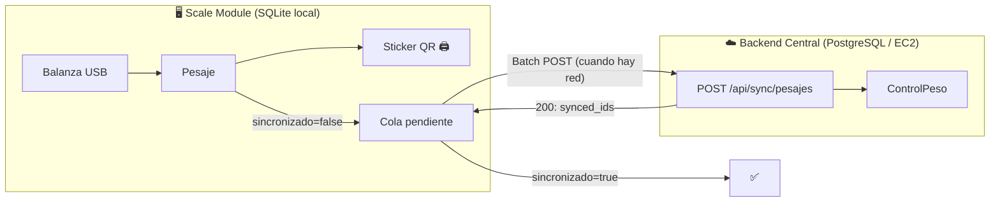
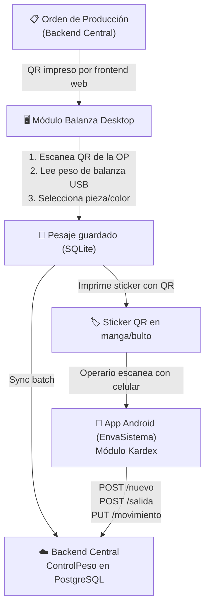
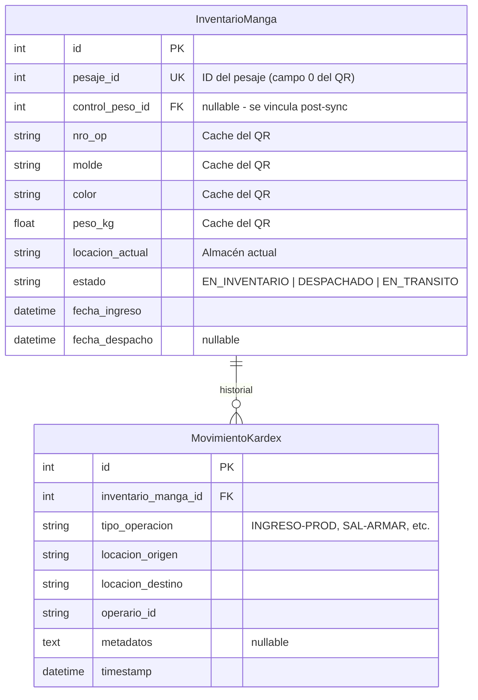

# Resumen: Entidad Pesajes, Sincronización Offline-First y Módulo Kardex

## 1. Entidad Pesaje — Módulo de Balanza (Desktop)

Modelo definido en [pesaje.py](file:///d:/Users/esteb/repos/envaperu-workflow-scale-module-desktop/backend/app/models/pesaje.py). Almacenado en **SQLite local** (offline-first).

| Atributo | Tipo | Descripción |
|:---|:---|:---|
| [id](file:///d:/Users/esteb/repos/envaperu-workflow-frontend/envaperu-frontend/src/services/api.js#89-98) | Integer PK | Auto-incremental |
| `peso_kg` | Float | Peso real leído de la balanza |
| `fecha_hora` | DateTime | Timestamp UTC del pesaje |
| [molde](file:///d:/Users/esteb/repos/envaperu-workflow-scale-module-desktop/backend/app/routes/sync.py#65-123) | String(100) | Nombre del molde (del QR: "CERNIDOR ROMANO") |
| `maquina` | String(50) | Máquina (del QR: "HT-250B") |
| `nro_op` | String(20) | Número de Orden de Producción (del QR: "OP1354") |
| `turno` | String(20) | Diurno / Nocturno |
| `fecha_orden_trabajo` | Date | Fecha OT del QR |
| `nro_orden_trabajo` | String(20) | Número de Orden de Trabajo |
| `peso_unitario_teorico` | Float | Peso teórico por pieza (del QR) |
| `operador` | String(100) | Nombre del operario |
| `color` | String(50) | Color del lote producido |
| `pieza_sku` | String(50) | SKU de la pieza seleccionada |
| `pieza_nombre` | String(100) | Nombre de la pieza |
| `observaciones` | Text | Notas libres |
| `sticker_impreso` | Boolean | Si ya se imprimió el sticker físico |
| `fecha_impresion` | DateTime | Cuándo se imprimió |
| [sincronizado](file:///d:/Users/esteb/repos/envaperu-workflow-scale-module-desktop/backend/app/routes/pesajes.py#228-244) | Boolean | **Flag offline-first** — si ya se envió al central |
| `fecha_sincronizacion` | DateTime | Cuándo se sincronizó |
| `qr_data_original` | String(500) | String crudo del QR escaneado |

### QR del Sticker impreso (output del pesaje)

Método [generate_sticker_qr_data()](file:///d:/Users/esteb/repos/envaperu-workflow-scale-module-desktop/backend/app/models/pesaje.py#156-176) genera un string separado por `;`:

```
ID;MOLDE;MAQUINA;NRO_OP;TURNO;FECHA_OT;NRO_OT;OPERADOR;COLOR;FECHA_HORA;PESO_KG;PIEZA_SKU;PIEZA_NOMBRE
```

> [!IMPORTANT]
> El **primer campo** es `pesaje.id` — identificador único del bulto. Este QR impreso en el sticker es el que luego escanea la **app Android (EnvaSistema/Kardex)** para registrar entradas y salidas de mangas en inventario.

---

## 2. Entidad ControlPeso — Backend Central

Modelo en [control_peso.py](file:///d:/Users/esteb/repos/envaperu-workflow/app/models/control_peso.py). Es la versión **ligera** que llega al backend central de PostgreSQL.

| Atributo | Tipo | Descripción |
|:---|:---|:---|
| [id](file:///d:/Users/esteb/repos/envaperu-workflow-frontend/envaperu-frontend/src/services/api.js#89-98) | Integer PK | Auto-incremental |
| `registro_id` | FK → `registro_diario_produccion` | Liga al registro diario padre |
| `peso_real_kg` | Float | Peso medido del bulto |
| `color_nombre` | String(50) | Color (texto) |
| `color_id` | FK → `color_producto` | Color (referencia, nullable) |
| `hora_registro` | DateTime | Timestamp UTC |
| `usuario_id` | Integer | Quién pesó (nullable) |

---

## 3. Sincronización Offline-First



### Flujo detallado

1. **Pesaje local** → Se guarda en SQLite con `sincronizado=false`
2. **Sticker** → Se imprime con QR que contiene los datos del pesaje
3. **Sync check** → `SyncService.check_connectivity()` hace GET a `/api/ordenes` del central
4. **Batch push** → `POST /api/sync/pesajes` envía lista de pesajes pendientes
5. **Respuesta** → El central responde con `synced_ids[]`
6. **Marcar** → Los pesajes exitosos se marcan `sincronizado=true` + timestamp

### Caches para operar offline

| Cache | Modelo | Fuente | Propósito |
|:---|:---|:---|:---|
| **CorrelativoCache** | [correlativo_cache.py](file:///d:/Users/esteb/repos/envaperu-workflow-scale-module-desktop/backend/app/models/correlativo_cache.py) | Talonarios del central | Generar RDPs consecutivos sin internet |
| **MoldePiezasCache** | [molde_cache.py](file:///d:/Users/esteb/repos/envaperu-workflow-scale-module-desktop/backend/app/models/molde_cache.py) | `/api/moldes/exportar` del central | Autocompletar piezas por molde sin internet |

---

## 4. Flujo Completo: Pesaje → Sticker QR → Kardex



---

## 5. API Kardex — Endpoints Implementados

Base URL: `POST /api/kardex/...` (Backend Central en [rutas_kardex.py](file:///d:/Users/esteb/repos/envaperu-workflow/app/api/rutas_kardex.py))

> [!WARNING]
> **Arquitectura Online-Only:** Todas las operaciones requieren conexión al backend. La app Android NO debe encolar transacciones localmente. Si no hay red, bloquear la operación y mostrar error al operario.

### Formato del QR del Sticker (actualizado)

```
ID;MOLDE;MAQUINA;NRO_OP;TURNO;FECHA_OT;NRO_OT;OPERADOR;COLOR;FECHA_HORA;PESO_KG;PIEZA_SKU;PIEZA_NOMBRE
```

Ejemplo: `42;CERNIDOR ROMANO;HT-250B;OP1354;DIURNO;2026-01-03;0001;Admin;ROJO;2026-01-03/14:30:00;5.2;CER-ROM-STD;Cernidor Romano`

> [!NOTE]
> El **primer campo** (`42`) es el `pesaje.id` — identificador único de cada manga/bulto. Separador: `;` (punto y coma).

---

### `POST /api/kardex/movimientos` — Endpoint Unificado

Registra ENTRADAS, SALIDAS y MOVIMIENTOS de mangas.

**Request:**
```json
{
    "codigo_qr": "42;CERNIDOR ROMANO;HT-250B;OP1354;DIURNO;2026-01-03;0001;Admin;ROJO;2026-01-03/14:30:00;5.2",
    "tipo_operacion": "INGRESO-PROD",
    "locacion_origen": "ZONA_PRODUCCION",
    "locacion_destino": "ALMACEN_PRINCIPAL",
    "operario_id": "user@gmail.com",
    "metadatos": "{\"turno\":\"DIURNO\",\"maquina\":\"HT-250B\"}",
    "timestamp": "2026-03-13T13:00:00Z"
}
```

**`tipo_operacion` — Valores usados por la app Android:**

| Valor | Screen de origen | Lógica backend |
|:---|:---|:---|
| `INGRESO-PROD` | ProduccionNuevaScreen | → **ENTRADA** |
| `INGRESO-DEV` | DevolucionNoArmadoScreen | → **ENTRADA** |
| `SAL-ARMAR` | ArmarPaquetesScreen | → **SALIDA** |
| `SAL-MERMA` | MermaMolinoScreen | → **SALIDA** |
| `SAL-VENTA` | VentaPTScreen | → **SALIDA** |
| `MOV-INTERNO` | TransferenciaInventarioScreen | → **MOVIMIENTO** |

**Respuestas por operación:**

#### ENTRADA (`INGRESO-*`)
| Código | Condición | Body |
|:---|:---|:---|
| `201` | Éxito | `{ "success": true, "mensaje": "Manga #42 ingresada...", "manga": {...} }` |
| `409` | Manga ya existe en inventario | `{ "error": "Este bulto (pesaje #42) ya fue registrado..." }` |

#### SALIDA (`SAL-*`)
| Código | Condición | Body |
|:---|:---|:---|
| `200` | Éxito | `{ "success": true, "mensaje": "Manga #42 despachada...", "manga": {...} }` |
| `404` | Manga no encontrada | `{ "error": "Manga con pesaje #42 no encontrada..." }` |
| `409` | Manga ya fue despachada | `{ "error": "Este bulto ya fue despachado el 2026-03-13..." }` |

#### MOVIMIENTO (`MOV-*`)
| Código | Condición | Body |
|:---|:---|:---|
| `200` | Éxito | `{ "success": true, "mensaje": "Manga #42 movida de A a B", "manga": {...} }` |
| `404` | Manga no encontrada | `{ "error": "..." }` |
| `409` | Estado no permite mover | `{ "error": "No se puede mover: estado actual es DESPACHADO" }` |
| `400` | Origen = Destino | `{ "error": "Locación de origen y destino no pueden ser iguales" }` |

---

### `GET /api/kardex/manga/<pesaje_id>` — Consultar Bulto

Retorna el estado actual de un bulto y todo su historial de movimientos.

**Ejemplo:** `GET /api/kardex/manga/42`

**Response `200`:**
```json
{
    "manga": {
        "id": 1,
        "pesaje_id": 42,
        "nro_op": "OP1354",
        "molde": "CERNIDOR ROMANO",
        "color": "ROJO",
        "peso_kg": 5.2,
        "locacion_actual": "ALMACEN_PRINCIPAL",
        "estado": "EN_INVENTARIO",
        "fecha_ingreso": "2026-03-13T13:00:00+00:00",
        "fecha_despacho": null
    },
    "movimientos": [
        {
            "id": 1,
            "tipo_operacion": "INGRESO-PROD",
            "locacion_origen": "ZONA_PRODUCCION",
            "locacion_destino": "ALMACEN_PRINCIPAL",
            "operario_id": "user@gmail.com",
            "timestamp": "2026-03-13T13:00:00+00:00"
        }
    ]
}
```

---

### `GET /api/kardex/inventario` — Stock Actual

Lista todas las mangas en inventario con filtros y agrupación por locación.

**Query params (todos opcionales):**

| Param | Descripción | Default |
|:---|:---|:---|
| `estado` | Filtrar por estado | `EN_INVENTARIO` |
| `locacion` | Filtrar por locación exacta | — |
| `nro_op` | Filtrar por OP | — |
| `color` | Filtrar por color (parcial) | — |

**Ejemplo:** `GET /api/kardex/inventario?locacion=ALMACEN_PRINCIPAL`

**Response `200`:**
```json
{
    "total_mangas": 15,
    "total_kg": 78.5,
    "por_locacion": {
        "ALMACEN_PRINCIPAL": { "cantidad": 10, "peso_kg": 52.0 },
        "ZONA_DESPACHO": { "cantidad": 5, "peso_kg": 26.5 }
    },
    "mangas": [ ... ]
}
```

---

## 6. Modelo de Datos del Kardex

Tablas en PostgreSQL (Backend Central) — [kardex.py](file:///d:/Users/esteb/repos/envaperu-workflow/app/models/kardex.py):



---

## 7. Observaciones y Decisiones Arquitectónicas

1. **Kardex como Online-Only (Single Source of Truth):** Se descartó la aproximación *Offline-First* para la App Android de inventario. Toda validación de almacén se hace en **tiempo real** contra el backend para prevenir el *Double Spending* e inventarios negativos.

2. **Manga = Pesaje:** No se creó una tabla `Manga` separada. `InventarioManga` solo rastrea ubicación y estado, referenciando al pesaje por su ID. Los datos descriptivos se cachean del QR para queries rápidos.

3. **Endpoint unificado:** Los 3 endpoints mock originales se consolidaron en `POST /api/kardex/movimientos`. El campo `tipo_operacion` controla la lógica.

4. **QR Sticker actualizado:** Se agregó `pesaje.id` como primer campo del QR del sticker para identificar unívocamente cada manga.

5. **Locaciones como string fijo:** Las locaciones (`ZONA_PRODUCCION`, `ALMACEN_PRINCIPAL`, `ALMACEN_PARTES`, `ZONA_DESPACHO`, `ENVA`, `ZONA_TRANSITO`) están hardcodeadas en la app. Pendiente: tabla `Almacen` con catálogo dinámico.

